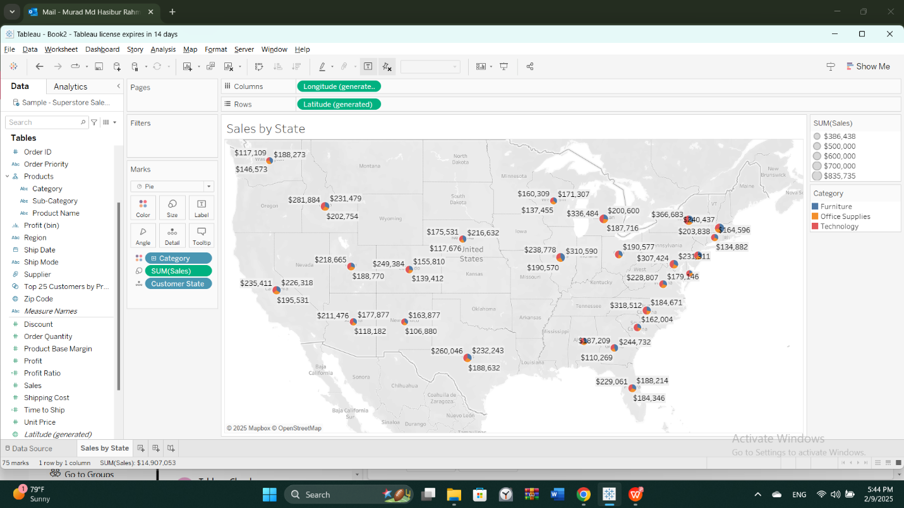
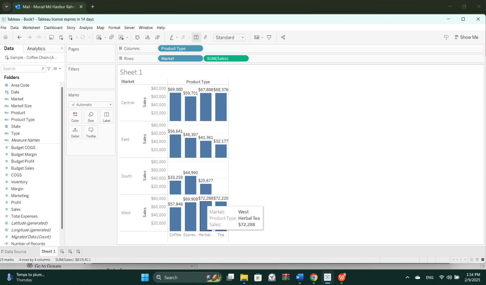
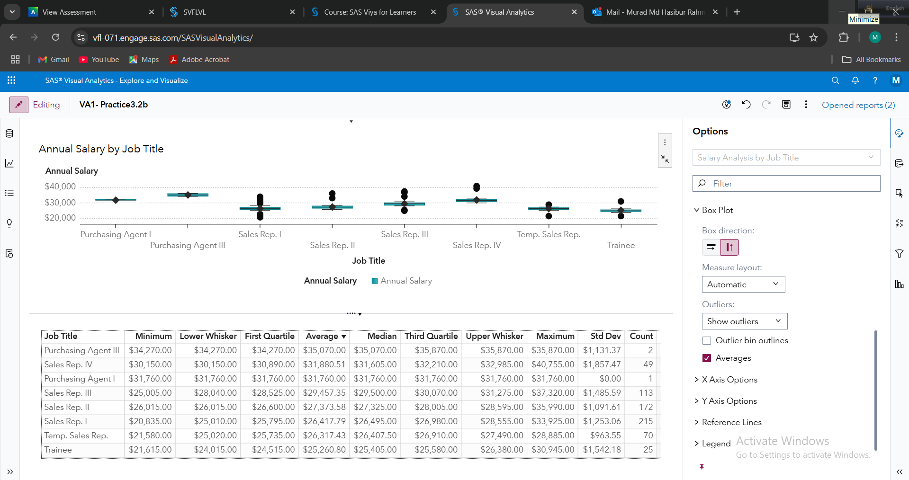
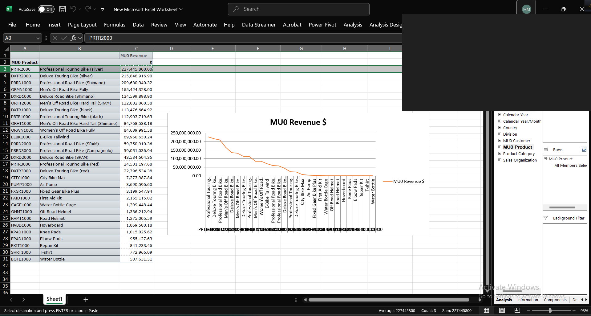

# Business Intelligence Portfolio

Hands-on Business Intelligence projects spanning the **full BI stack** — from dimensional data modeling and SQL through data visualization and enterprise reporting in SAP. Built during **MISY 5360 – Business Intelligence** at Lamar University and extended with reproducible SQL so the analysis can be read, run, and reviewed — not just viewed.

> **MD Hasibur Rahman Murad** — aspiring Business Intelligence / Data Analyst
> **Skills:** SQL · Dimensional Modeling (star/snowflake) · Tableau · SAS Visual Analytics · SAP BW · Excel
> 📫 muradhasib01@gmail.com · 🔗 [github.com/muradhasib01](https://github.com/muradhasib01)

---

## 🧰 Skills & Tools Demonstrated

| Area | Tools / Concepts |
|------|------------------|
| **SQL** | Joins across a star schema, aggregation, `HAVING`, `CASE`, CTEs, window functions (`RANK`, running totals, % of total) |
| **Data Warehousing & Modeling** | OLTP vs. OLAP, star & snowflake schemas, fact/dimension design, DataSources |
| **Databases** | Microsoft Access — relational & dimensional design, queries |
| **Statistical / Visual Analytics** | SAS Visual Analytics — box plots, category vs. measure, aggregation |
| **Data Visualization** | Tableau — geographic maps, cross-tab charts, dashboards |
| **Spreadsheet Analytics** | Microsoft Excel — analysis & reporting |
| **Enterprise BI** | SAP Business Warehouse — InfoObjects, Key Figures, exception aggregation, revenue reporting |

---

## 🖼️ Highlights

| Tableau — Sales by State (geo map) | Tableau — Sales by Market & Product |
|:---:|:---:|
|  |  |

| SAS Visual Analytics — Salary Box Plots | SAP BW — Revenue by Product |
|:---:|:---:|
|  |  |

---

## ⭐ Featured: Coffee Chain — End-to-End BI

A single dataset carried through the whole BI pipeline, showing I can go from **raw model → query → visual insight**:

1. **Model** — designed a star schema (fact + product/store/budget dimensions) in MS Access → [`03-ms-access/`](03-ms-access/)
2. **Query** — wrote the schema as portable SQL plus an analytical query library → [`coffee-chain-star-schema.sql`](03-ms-access/coffee-chain-star-schema.sql) · [`coffee-chain-analytics-queries.sql`](03-ms-access/coffee-chain-analytics-queries.sql)
3. **Visualize** — turned the same questions into Tableau dashboards → [`05-tableau/`](05-tableau/)

**Business questions answered:** Which product types drive profit in each market? Which products *lose* money? How does each market contribute to total sales? *(See the SQL for the reproducible answers.)*

---

## 📂 Project Index

Each folder frames a **business question**, then links the deliverable (PDF viewable in-browser).

### 1. [OLTP vs. OLAP](01-oltp-olap/) — *Why can't a manager make decisions from a transaction report?*
Contrasts transactional (OLTP) systems with analytical (OLAP) reporting on a Global Bike Inc. sales scenario, and shows how an analytical view enables decision-making.
- 📄 [OLTP vs. OLAP Analysis](01-oltp-olap/A1-OLTP-vs-OLAP-Analysis.pdf)

### 2. [Data Analysis](02-data-analysis/) — *Which product lines are underperforming?*
Identifies lowest-profit categories, loss-making products, and top cities by orders and profit.
- 📄 [Product Category Analysis](02-data-analysis/A2-Product-Category-Analysis.pdf) · 📄 [Sales Data Analysis](02-data-analysis/HW4-Sales-Data-Analysis.pdf)

### 3. [SQL & MS Access](03-ms-access/) — *How do you model sales data for fast analytical querying?*
A star-schema data warehouse designed in Access, plus reproducible SQL (DDL + analytical queries).
- 🗄️ [Star Schema DDL (SQL)](03-ms-access/coffee-chain-star-schema.sql) · 🗄️ [Analytical Queries (SQL)](03-ms-access/coffee-chain-analytics-queries.sql)
- 🗄️ [Coffee Store DB](03-ms-access/coffee-store-database.accdb) · 🗄️ [Relational DB](03-ms-access/A3-relational-database.accdb)

### 4. [SAS Visual Analytics](04-sas/) — *What does the distribution of pay and profit look like?*
Data-item classification, frequency/aggregation, box-plot distributions, and cross-country profitability.
- 📄 [Data Classification](04-sas/A5-SAS-Data-Classification.pdf) · 📄 [Box Plots](04-sas/A6-SAS-Visual-Analytics.pdf) · 📄 [Profitability](04-sas/A9-SAS-Profitability-Analysis.pdf)

### 5. [Tableau](05-tableau/) — *Where and what should the business sell more of?*
Interactive visualizations of coffee-chain and superstore sales — profit by product/market and a geographic sales map.
- 📄 [Coffee Chain Profit](05-tableau/A7-Tableau-Coffee-Chain-Profit.pdf) · 📄 [Sales Geography](05-tableau/A8-Tableau-Sales-Geography.pdf)

### 6. [Excel](06-excel/) — *Fast analysis without a database.*
BI analysis performed in Excel.
- 📄 [Excel BI Analysis (PDF)](06-excel/A10-Excel-BI-Analysis.pdf) · 📊 [Workbook (source)](06-excel/A10-Excel-BI-Analysis.xlsx)

### 7. [SAP Business Warehouse](07-sap-bw/) — *How does enterprise BI report revenue at scale?*
SAP BW on the Global Bike Inc. dataset — revenue reporting, InfoObject/Key Figure design, exception aggregation, and mapping a DataSource onto a snowflake-schema fact table.
- 📄 [Revenue Reporting](07-sap-bw/A11-SAP-BW-Revenue-Reporting.pdf) · 📄 [InfoObjects & Key Figures](07-sap-bw/A12-SAP-BW-InfoObjects.pdf) · 📄 [Material InfoObjects](07-sap-bw/A13-SAP-BW-Material-InfoObjects.pdf) · 📄 [DataSource & Schema](07-sap-bw/A14-SAP-BW-DataSource-Schema.pdf)

---

## 📌 About This Repository

A semester of BI coursework, organized as a browsable portfolio and **extended with reproducible SQL**. Written deliverables are exported to PDF so they render on GitHub; Access databases, the Excel workbook, and SQL scripts are included as source. Datasets are standard BI teaching sets (Coffee Chain, Global Bike Inc., Superstore) used to demonstrate technique end-to-end.

*Coursework for MISY 5360 at Lamar University, extended for portfolio use.*
